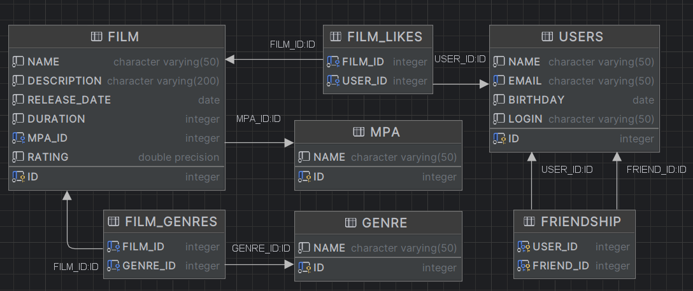

# java-filmorate
Template repository for Filmorate project.

## Filmorate project ER-diagram


## Приложение умеет

- Создавать пользователей, добавлять фильмы и хранить их в Базе Данных
- Добавлять других пользователей в друзья
- Оценивать фильмы
- Получать списки пользователей и фильмов
- Получать списки общих друзей
- Получать данные отдельных пользователей и фильмов

## Примеры запросов к БД

- Запрос на создание записи фильма в БД
```sql
INSERT INTO FILMS (FILM_NAME, DESCRIPTION, RELEASE_DATE, DURATION, RATE, MPA_ID) VALUES(?,?,?,?,?,?)
 ```
- Запрос на создание записи пользователя в БД
```sql
INSERT INTO USERS (EMAIL, LOGIN, USER_NAME, BIRTHDAY) VALUES(?,?,?,?)
 ```
- Запрос на добавление пользователя в друзья по его ID
```sql
INSERT INTO FRIENDS (USER_ID, FRIEND_ID) VALUES(?,?)
 ```
- Запрос на получение рейтинга фильма по его ID
```sql
SELECT COUNT(USER_ID) FROM LIKES WHERE FILM_ID=?
 ```